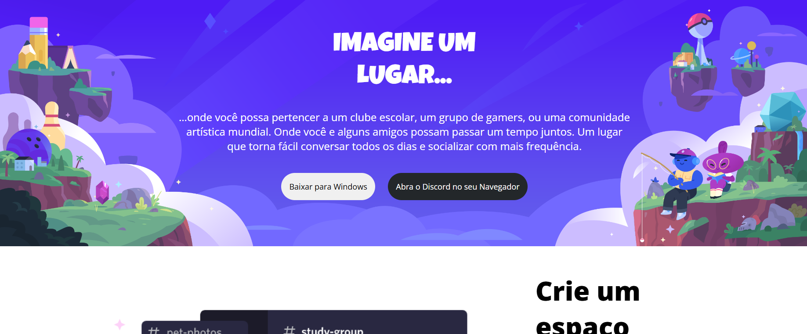
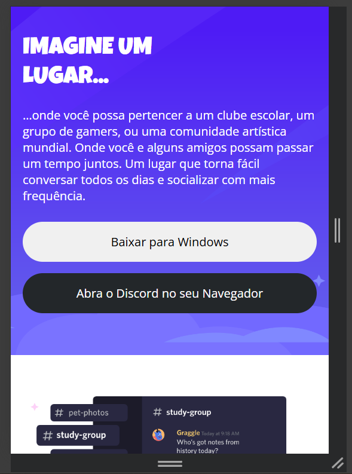
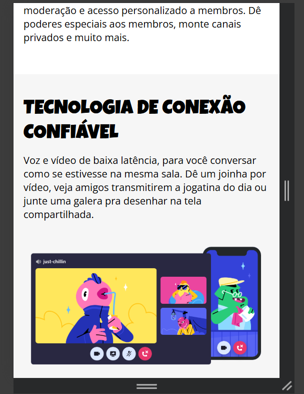

# 💬 Clone do Discord – Projeto DIO  

  
  
  
  

Este desafio é um **clone simplificado da interface do Discord**, desenvolvido durante o curso da [DIO](https://www.dio.me).  
O foco foi praticar **HTML5** e **CSS3**, aplicando **media queries** para criar um layout responsivo que se adapta a telas **desktop e mobile**.  

---

## 🚀 Tecnologias Utilizadas  
- **HTML5** – Estrutura semântica do conteúdo  
- **CSS3** – Estilização da interface  
- **Media Queries** – Responsividade para diferentes tamanhos de tela  
- **Flexbox** – Criação e organização do layout

---

## Prévia do Projeto  

### 💻 Versão Desktop  
<div align="center">  
    
  <br><br>  
    
</div>  

### 📱 Versão Mobile  
<div align="center">  
    
  <br><br>  
    
</div>  

---

## 📂 Estrutura de Pastas  
```plaintext
📦 clone-discord-responsivo
 ┣ 📂 assets
 ┃ ┗ 📂 images      # Prints e imagens do projeto
 ┣ 📂 css           # Arquivos de estilo
 ┣ 📜 index.html    # Página principal
 ┗ 📜 README.md     # Documentação do projeto

```

--- 

### 🏆 Créditos

Desafio desenvolvido como parte do curso da Digital Innovation One
.